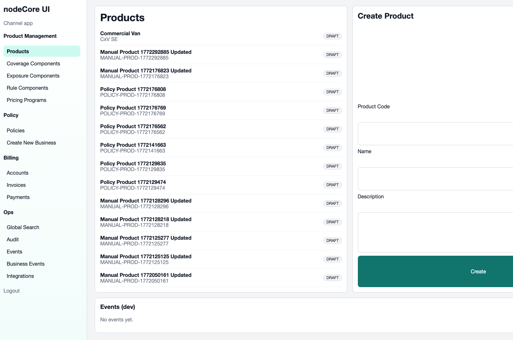
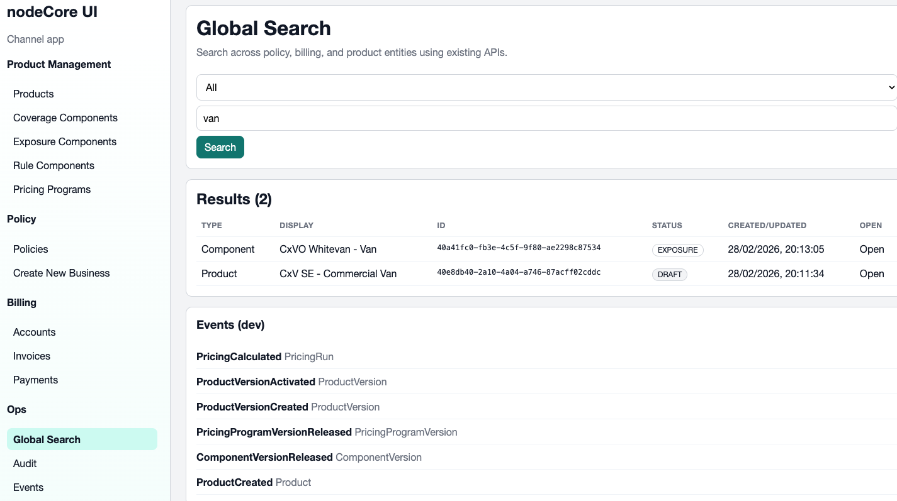
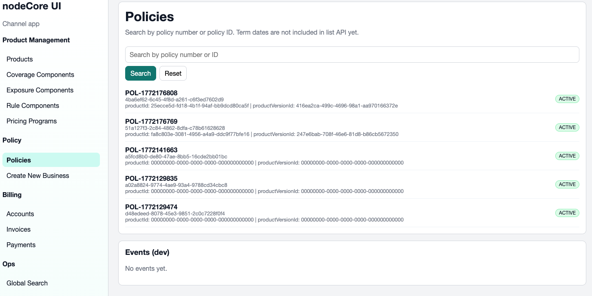
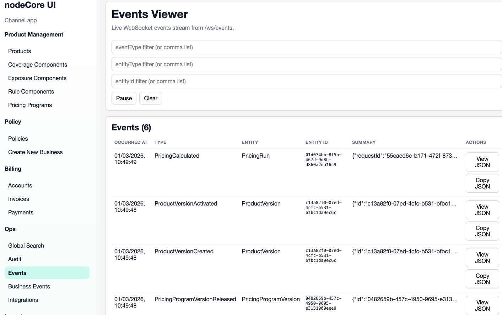
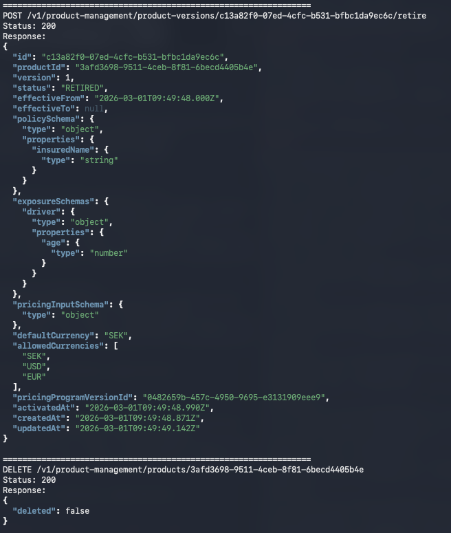
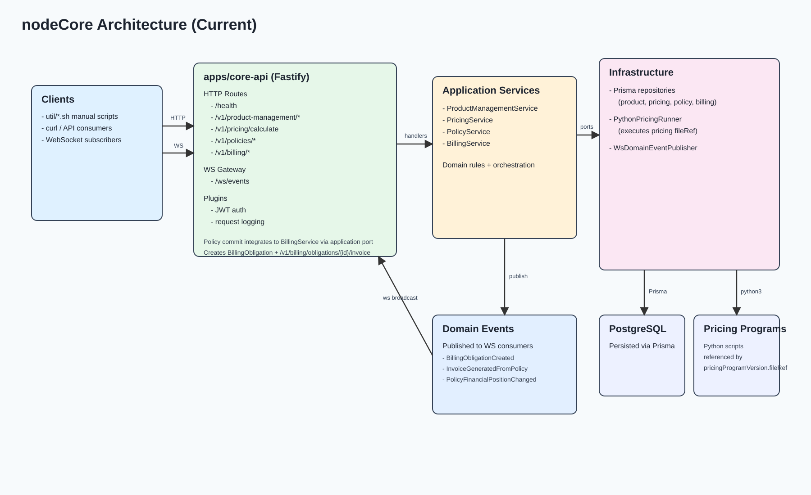
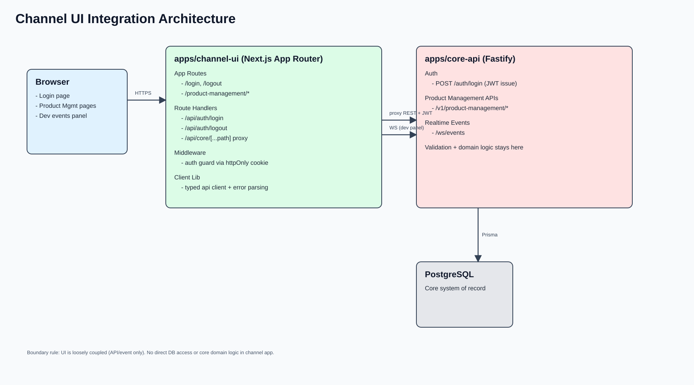
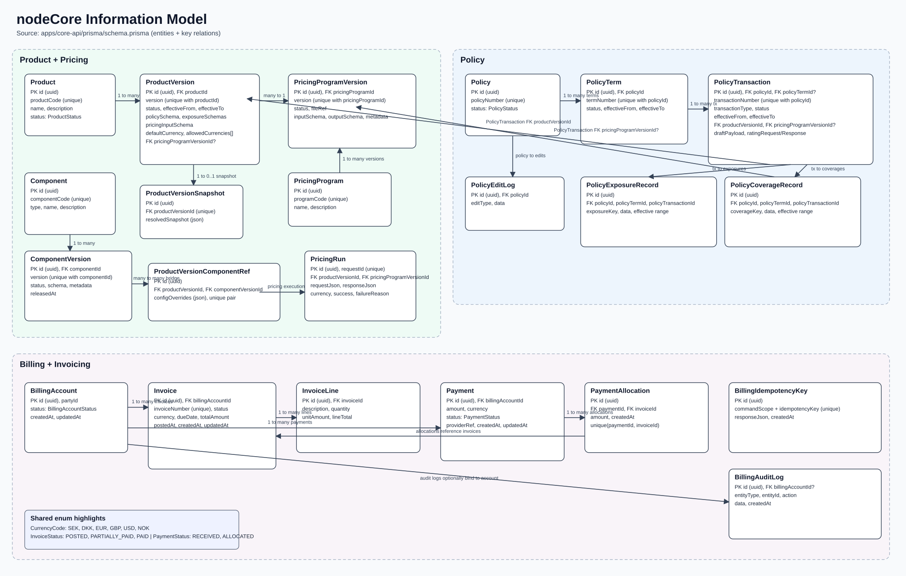

# nodeCore - Core insurance system for training

`nodeCore` is a training/concept P&C core platform with a headless API (`apps/core-api`) and a channel UI (`apps/channel-ui`).

Current implemented focus areas:

- Product Management
- Policy Administration
- Billing & Invoicing
- Pricing execution integration
- Ops tooling (search + event streams)

Run demo (backend + frontend) from repo root:

- `bash demo-start.sh`

Then open:

- UI: `http://localhost:3000`
- API: `http://localhost:4000`

Architecture/design guidance is documented in `docs/`.

## A few examples

Simple UI is added just to show the concept. Editing is directly in json text and things are kept simple though, but all concepts, including events are shown

Then you can see how the global search looks here

And policies like this currently.

And the events page when something is going on

And finally, just a clip of the api json output from the test script

## Architecture and data model outlined

